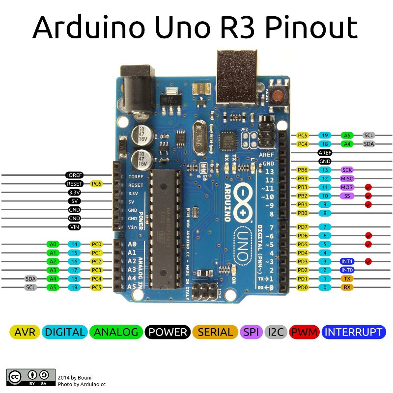

# Robo chassis

## General Plan of work
1. Make motors running all together
1. Get readback from Hall sensors
1. Make system that move motors according to readback
1. Build test version chassis / trolley with 4 motors
1. Develop complete system of chassis move (forward, backward, left, right, turn left, turn right)
1. Add IMU (Inertial Measurement Unit) to Arduino

## ToDoToDoToDo
* Direction **A** (Schemes 4 or 5)
1. Find the new AdaFruit library that uses I2C
1. Run motors with the new library
1. Check compatibility of I2C with IMU and Motors Driver 
1. Connect IMU and Motors Driver to Arduino

* Direction **B** (Schemes 1-3)
1. Find out which Arduino pins exactly used for DC motors
1. Test the Scheme_1 
1. If Scheme_1 does not work switch to Scheme_2
1. Use I2C Scheme

* Common
5. Build the readout from Hall Sensors
5. Adjust logic for motors moves 
5. Combine readout and motor control
5. ...

## Arduino
#### Info about Arduino
How interrupts of all Arduino pins can be used:
https://playground.arduino.cc/Main/PinChangeInterrupt/

Useful description of Arduino pins (helps during development):
https://roboticsbackend.com/arduino-uno-pins-a-complete-practical-guide/

#### Arduino should do a few tasks:
1. Provide data from IMU (inertial measurement unit) to Jetson Nano
1. Provide motor status to Jetson Nano ("moving", "ready", "not ready", "warning", "error")
1. Receive atomic commands from Jetson Nano (like "move_fwd(N_steps)", "move_left(N_steps)", "turn_right(N_degrees)")
1. Control the motors using readback from Hall sensors

#### Arduino pins

## Info about Motors

#### Links to the motors in Internet:
1. https://www.aliexpress.com/item/32610023512.html
1. QR-code from the motor:
* https://github.com/SmartArduino/SZDOITWiKi/wiki
* https://github.com/SmartArduino/SZDOITWiKi/wiki/9V-motor-with-Hall-sensor
* Motor Documentation: https://github.com/SmartArduino/XPT/blob/master/GM25-370DataSheetSR04-T2.pdf

#### Motor pins

## Info about Motors Driver (Arduino shield)
1. https://playground.arduino.cc/Main/AdafruitMotorShield/
1. How to use DC-motors: https://learn.adafruit.com/adafruit-motor-shield/using-dc-motors
1. GitHub Library: https://github.com/adafruit/Adafruit-Motor-Shield-library
1. Shield connections: http://yourduino.com/docs/Multi-MotorShieldSchematic.jpg

#### Motors Driver Scheme

## Chassis / Trolley operation layout

## Plan for Motors connections
Scheme_1

Scheme_2

Scheme_3

Scheme_4

Scheme_5

